<a href="https://rishitha-portfolio-olive.vercel.app/">
  
</a>

<p align="center">
  <a href="https://rishitha-portfolio-olive.vercel.app/"></a>
  <a href="https://www.linkedin.com/in/rishitha-reddy-mekala"></a>
  <a href="mailto:rishithareddymekala@gmail.com"></a>
</p>


<br/><br/>

<picture>
  <source media="(prefers-color-scheme: dark)" srcset="assets/sec-about.svg"/>
  <source media="(prefers-color-scheme: light)" srcset="assets/sec-about-light.svg"/>
  
</picture>

```ts
const rishitha = {
  role:      "Software Developer – AI Systems",
  company:   "Redeem Care PRO",
  building:  "AI clinical pain assessment",
  stack:     ["React Native", "Node.js", "AWS"],
  ai:        ["Gemini", "Claude", "LLaMA"],
  education: "M.S. CS, University of Houston",
  published: "Marine Ecology (Wiley), 2025",
  openTo:    ["SWE", "AI/ML", "Data", "Cloud"],
};
```

<picture>
  <source media="(prefers-color-scheme: dark)" srcset="assets/sec-experience.svg"/>
  <source media="(prefers-color-scheme: light)" srcset="assets/sec-experience-light.svg"/>
  
</picture>

<picture>
  <source media="(prefers-color-scheme: dark)" srcset="assets/experience.svg"/>
  <source media="(prefers-color-scheme: light)" srcset="assets/experience-light.svg"/>
  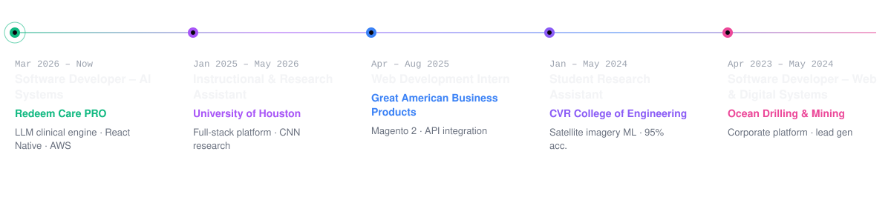
</picture>

<br/>

<picture>
  <source media="(prefers-color-scheme: dark)" srcset="assets/sec-projects.svg"/>
  <source media="(prefers-color-scheme: light)" srcset="assets/sec-projects-light.svg"/>
  
</picture>

<p align="center">
  <a href="https://github.com/rishireddy1229/Storm-Severity-Mining-at-Scale">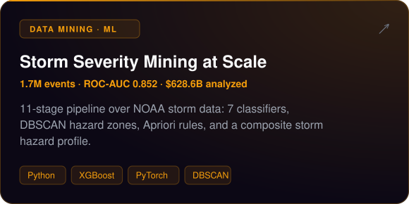</a>
  <a href="https://github.com/rishireddy1229/cloud-native-ml-movie-recommender">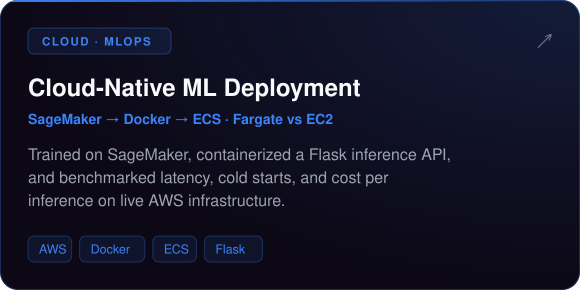</a>
  <a href="https://github.com/rishireddy1229/Movie-Recommendation-System">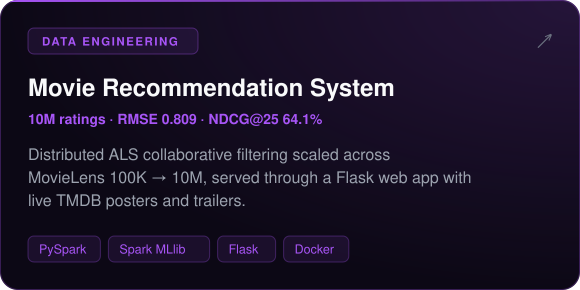</a>
  <a href="https://github.com/rishireddy1229/vegetation-corridor-analysis">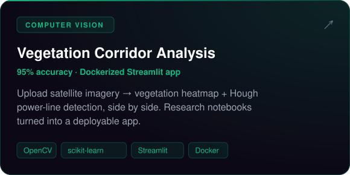</a>
  <a href="https://github.com/rishireddy1229/College-of-Pharmacy-Digital-Accessibility-Automation-Systems">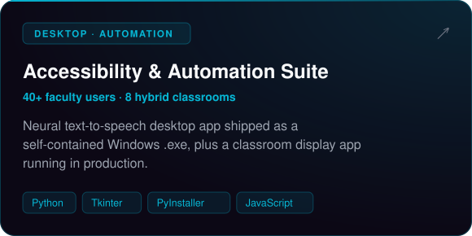</a>
  <a href="https://github.com/rishireddy1229/Student-Project-Management-System">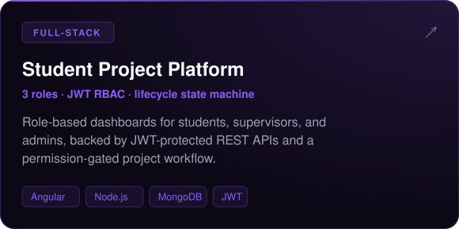</a>
</p>

<p align="center"><a href="https://rishitha-portfolio-olive.vercel.app/#projects"><b>See all 14 projects on my portfolio →</b></a></p>

<picture>
  <source media="(prefers-color-scheme: dark)" srcset="assets/sec-stack.svg"/>
  <source media="(prefers-color-scheme: light)" srcset="assets/sec-stack-light.svg"/>
  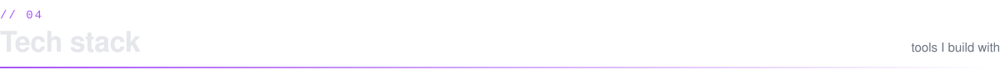
</picture>

<p align="center">
  <br/>
  <br/>
  
</p>

<picture>
  <source media="(prefers-color-scheme: dark)" srcset="assets/sec-activity.svg"/>
  <source media="(prefers-color-scheme: light)" srcset="assets/sec-activity-light.svg"/>
  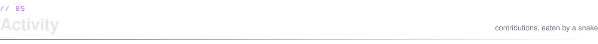
</picture>

<picture>
  <source media="(prefers-color-scheme: dark)" srcset="https://raw.githubusercontent.com/rishireddy1229/rishireddy1229/output/github-snake-dark.svg"/>
  <source media="(prefers-color-scheme: light)" srcset="https://raw.githubusercontent.com/rishireddy1229/rishireddy1229/output/github-snake.svg"/>
  
</picture>

<picture>
  <source media="(prefers-color-scheme: dark)" srcset="assets/footer.svg"/>
  <source media="(prefers-color-scheme: light)" srcset="assets/footer-light.svg"/>
  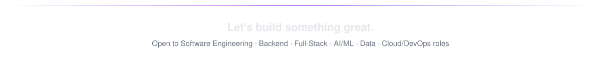
</picture>
